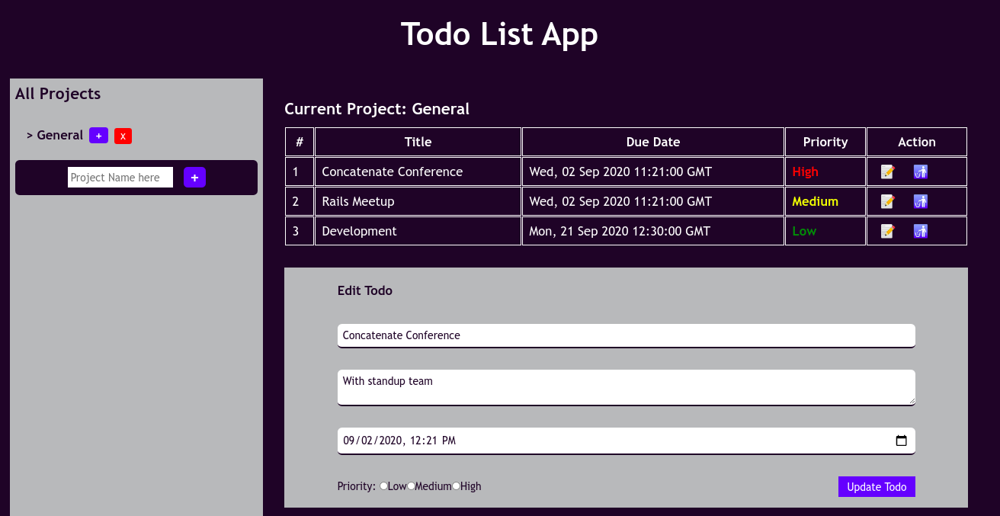

# Todo List App

> This is a project aimed at implementing lessons learned on JavaScript ojects, factory functions, ES6 module pattern and webpack. The project provides a simple Todo List application by dividing Todos into categories (projects). Users can create, rename and delete categories. For each of the categories, users can add zero or more Todos. Todos can also be created, updated or deleted.

## Built With

- HTML
- SASS
- Bootstrap
- JavaScript (ES6)
- LocalStorage
- Webpack

## Live Demo

<a href="https://teekaytech.github.io/Todo-List/" target="_blank">Todo List Application</a>

## Getting Started

To get a local copy up and running follow these simple example steps.

- On the project GitHub page, navigate to the main page of the repository [this page](https://github.com/teekaytech/Todo-List.git).
- Under the repository name, locate and click on a green button named `Code`.
- Copy the project URL as displayed.
- If you're running Windows Operating System, open your command prompt. On Linux, Open your terminal.
- Change the current working directory to the location where you want the cloned directory to be made. Leave as it is if the current location is where you want the project to be.
- Type `git clone`, and then paste the URL you copied in Step 3. 
  `$ git clone https://github.com/teekaytech/Todo-List.git` <em>Press Enter key</em> 
- Press Enter. Your local copy will be created.

Please Note that you must have github installed on your PC, this can be done [here](https://gist.github.com/derhuerst/1b15ff4652a867391f03).

### Prerequisites

Web browser (Chrome/Firefox)

### Usage

Click on the live demo link and peruse the app.

### Making Changes

- `npm install` to install the dependencies and packages
- `npm start` to test the app after changes were made

- Run the following command simultaneously:

  ``

## Author

👤 **Taofeek Olalere**

- Github: [@teekaytech](https://github.com/teekaytech)
- Twitter: [@ola_lere](https://twitter.com/ola_lere)
- Linkedin: [olaleretaofeek](https://linkedin.com/in/olaleretaofeek)
- Portfolio: [Olalere Taofeek](https://teekaytech.github.io/olaleretaofeek/)

## 🤝 Contributing

Contributions, issues and feature requests are welcome!

Feel free to check the [issues page](issues/).

## Show your support

Give a ⭐️ if you like this project!

## Acknowledgments

- [Microverse](https://.microverse.org/)
- [The Odin Project (Project Spec)](https://www.theodinproject.com/courses/javascript/lessons/todo-list)

## 📝 License

This project is [MIT](lic.url) licensed.
